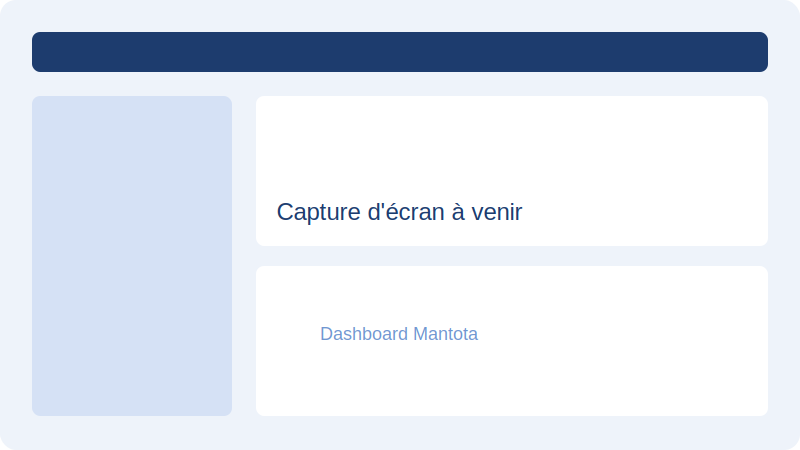

  

  
  <h1>Mantota</h1>
  
<strong>Plateforme de marketing d'influence et d'e-commerce intelligent pour l'Afrique de l'Ouest</strong>

  

    
    
    
    
  

---

## Table des matières

- [Présentation](#présentation)
- [Le problème](#le-problème)
- [La solution](#la-solution)
- [Fonctionnalités principales](#fonctionnalités-principales)
- [Architecture générale](#architecture-générale)
- [Technologies utilisées](#technologies-utilisées)
- [Feuille de route](#feuille-de-route)
- [Captures d'écran](#captures-décran)
- [Démo](#démo)
- [Liens officiels](#liens-officiels)
- [Contact](#contact)

---

## Présentation

**Mantota** est une plateforme technologique dédiée au marketing d'influence et à l'e-commerce en Afrique de l'Ouest francophone. Elle connecte annonceurs, créateurs de contenu et consommateurs dans un écosystème sécurisé, transparent et axé sur l'impact local.

Mantota combine :
- Une **marketplace** de campagnes publicitaires entre annonceurs et influenceurs.
- Un **module e-commerce** avec escrow et paiement Mobile Money.
- Un **studio UGC** pour la production de contenu sponsorisé.
- Un **système KYC** et de scoring pour la confiance entre acteurs.
- Une **roadmap IA** pour l'automatisation, la recommandation et l'analyse de performance.

---

## Le problème

En Afrique de l'Ouest, les marques et les PME peinent à :
- Identifier et collaborer avec des créateurs de contenu pertinents localement.
- Sécuriser les paiements et les livraisons dans l'e-commerce.
- Mesurer le retour sur investissement de leurs campagnes d'influence.
- Accéder à des outils numériques adaptés aux réalités locales (Mobile Money, FCFA, faible bancarisation).

Les créateurs de contenu, quant à eux, manquent d'une plateforme structurée pour monétiser leur audience, recevoir des commandes et gérer leur activité professionnellement.

---

## La solution

Mantota propose un **écosystème unifié** qui répond à ces défis :

- **Pour les annonceurs (Vendors)** : lancer des campagnes, choisir des créateurs, suivre les performances et vendre des produits via une boutique intégrée.
- **Pour les influenceurs (Influencers)** : postuler à des campagnes, générer des liens de promotion, gérer un wallet et proposer des services UGC.
- **Pour les consommateurs** : acheter des produits locaux en toute confiance avec un système de paiement sécurisé et un suivi de commandes.
- **Pour l'administration** : un panneau de contrôle sécurisé pour valider les KYC, superviser les transactions et garantir le bon fonctionnement de la plateforme.

---

## Fonctionnalités principales

- **Campagnes publicitaires** : création, gestion et suivi de campagnes CPC et CPM.
- **E-commerce avec escrow** : achats sécurisés entre vendeurs et acheteurs.
- **Paiements Mobile Money** : intégration des principales solutions locales (Feexpay, Moneroo, etc.).
- **Wallet intégré** : dépôts, retraits, commissions et historique des transactions.
- **Studio UGC** : commande de contenu sponsorisé auprès de créateurs.
- **KYC et scoring** : vérification des identités et évaluation des utilisateurs.
- **Système de parrainage** : croissance organique via les ambassadeurs.
- **Notifications multicanal** : SMS, WhatsApp, e-mail et push.
- **Analytics** : tableaux de bord de performance pour annonceurs et influenceurs.
- **Roadmap IA** : recommandation de créateurs, scoring de campagnes, modération automatique.

---

## Architecture générale

Mantota repose sur une architecture moderne, modulaire et scalable :

- **Backend** : API REST sécurisée avec Laravel, base de données MySQL, gestion des files d'attente et WebSockets.
- **Frontend** : interface réactive avec Vue 3, Inertia.js, TailwindCSS et Vite.
- **Paiements** : intégration multi-gateway avec support du Mobile Money et de l'escrow.
- **IA / Analytics** : modules d'analyse de données, scoring et recommandation (roadmap).
- **Infrastructure** : prête pour le déploiement sur hébergement mutualisé et évolutive vers le cloud.

Pour plus de détails, consulter :
- [`docs/architecture.md`](docs/architecture.md)
- [`docs/features.md`](docs/features.md)
- [`docs/business-model.md`](docs/business-model.md)
- [`docs/ai-roadmap.md`](docs/ai-roadmap.md)
- [`docs/api.md`](docs/api.md)
- [`docs/faq.md`](docs/faq.md)

---

## Technologies utilisées

### Backend

### Frontend

### DevOps & Outils

---

## Feuille de route

| Phase | Objectif | Statut |
| :--- | :--- | :--- |
| **Phase 1** | Fondation technique, authentification, KYC, wallet | En cours |
| **Phase 2** | Campagnes publicitaires, marketplace influenceurs | À venir |
| **Phase 3** | E-commerce avec escrow et paiements Mobile Money | À venir |
| **Phase 4** | Studio UGC et commandes de contenu | À venir |
| **Phase 5** | Intelligence artificielle : recommandation, scoring, modération | À venir |
| **Phase 6** | Expansion régionale et API publique | À venir |

Consulter [`ROADMAP.md`](ROADMAP.md) et [`docs/ai-roadmap.md`](docs/ai-roadmap.md) pour le détail.

---

## Captures d'écran

> Les captures d'écran seront ajoutées progressivement dans le dossier [`assets/screenshots/`](assets/screenshots/).

  
  
<em>Dashboard Mantota — placeholder</em>

---

## Démo

Une démo publique sera disponible prochainement dans le dossier [`demo/`](demo/).

---

## Liens officiels

- **Site web** : [À compléter](https://)
- **Documentation** : [`docs/`](docs/)
- **Portfolio** : [stanislas-nouemou](https://github.com/stanislas-nouemou)
- **GitHub** : [mantota](https://github.com/stanislas-nouemou/mantota)

---

## Contact

Pour toute question, partenariat ou opportunité d'investissement :

- **Email** : [À compléter](mailto:)
- **LinkedIn** : [À compléter](https://linkedin.com/in/)
- **GitHub** : [@stanislas-nouemou](https://github.com/stanislas-nouemou)

---

  Mantota — Construire l'avenir du digital en Afrique de l'Ouest.

